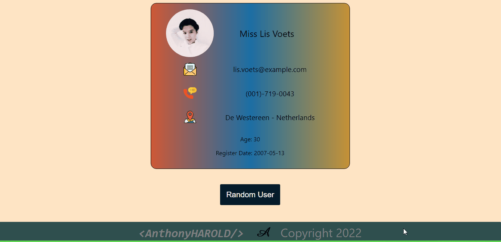

# Random User App 

## Description

Project aims to create a Random User App.

## Project Skeleton

```
Random User App 
|
|----readme.md         
SOLUTION
├── public
│     └── index.html
├── src
│    ├── assets
│    │       └── [images]
│    ├── components
│    │       ├── footer
│    │       |      ├── Footer.jsx
│    │       |      └── Footer.css
│    │       ├── RandomUser.js
│    ├── App.js
│    ├── App.css
│    ├── index.js
│    └── index.css
├── package.json
```




## Objective

Build a Random User App using ReactJS.
